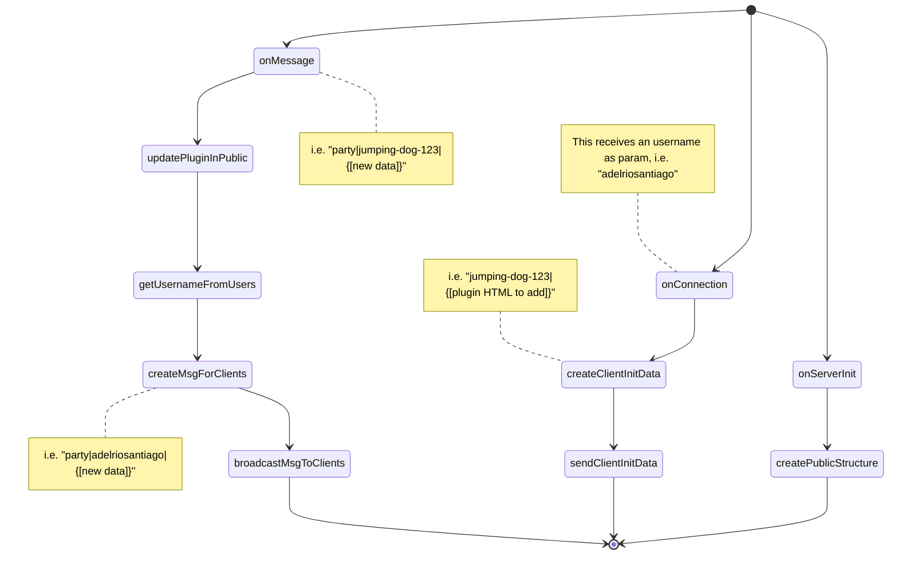

# crowwwd-noot

The crowwwd-noot variant does not use operational transform by default. Below is described how this work.

### Server

All user information is stored in the `users`  global variable. It maps UUID to usernames. For example:

``` json
const users = {
    "jumping-dog-123": "adelriosantiago",
	"sleeping-cat-321": "scasbyte",
    // ... and so on for other users
}
```

A matching UUID and username is what makes an user an authenticated one. For this reason UUIDs should never be shared to the client.

Information about the each plugin is stored in `public`. For example:

```js
const public = {
	"party": {
    	"jumping-dog-123": {
            pos: {
            	x: 13,
                y: 24,
            }
        },
    	"sleeping-cat-321": {
            pos: {
            	x: 88,
                y: 75,
            }
        },
	    // ... and so on for other users
    }
}
```

With these structures the state diagram when a user connects happens as follows:





### Client


## SO resources:

 - https://stackoverflow.com/questions/5100376/how-to-watch-for-array-changes